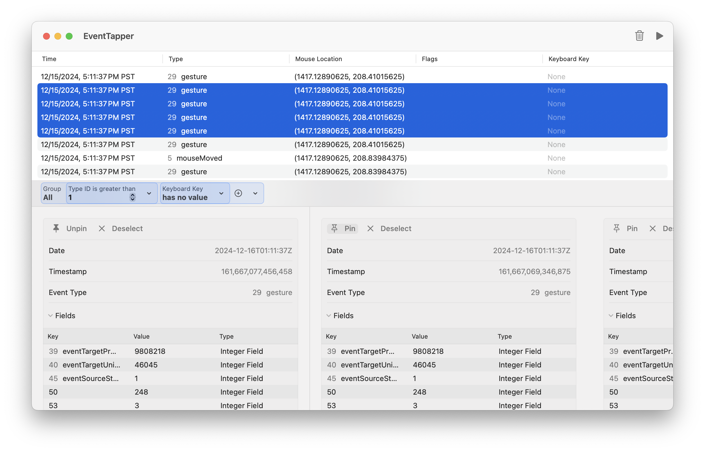

# EventTapper

A suite of debugging tools for monitoring system events on macOS, built on top of [EventTapCore](https://github.com/philptr/EventTapCore).

## Tools

### EventTapper

A native macOS application built with SwiftUI and AppKit for monitoring and debugging system events in real-time. Features include:



### EventTapCLI

A command-line interface for monitoring system events, perfect for scripts and terminal-based workflows.

```bash
# Monitor all events
event-tap

# Monitor keyboard events for 30 seconds
event-tap --duration 30 --types keyboard

# Monitor with timestamps in JSON format
event-tap -t --json

# Monitor specific event fields
event-tap --fields 39,40,45 --labeled-fields

# General usage
USAGE: event-tap [--duration <duration>] [--location <location>] [--placement <placement>] [--types <types>] [--fields <fields> ...] [--labeled-fields <labeled-fields>] [--json] [--timestamp]
```

## CLI Usage

```bash
OVERVIEW: Monitor system events like keyboard and mouse input

OPTIONS:
  -d, --duration         Duration to monitor (in seconds)
  -l, --location        Location to monitor from (hid/session/annotated)
  -p, --placement       Tap placement (head/tail)
  --types              Filter by event type
  --fields             Display specific field values
  --labeled-fields     Show field labels
  --json              JSON output format
  -t, --timestamp     Include timestamps
```

## Requirements

- macOS 15.0 or later
- Swift 5.9 or later for building from source

## Acknowledgments

- [EventTapCore](https://github.com/philptr/EventTapCore)
- [PredicateView](https://github.com/philptr/PredicateView)
